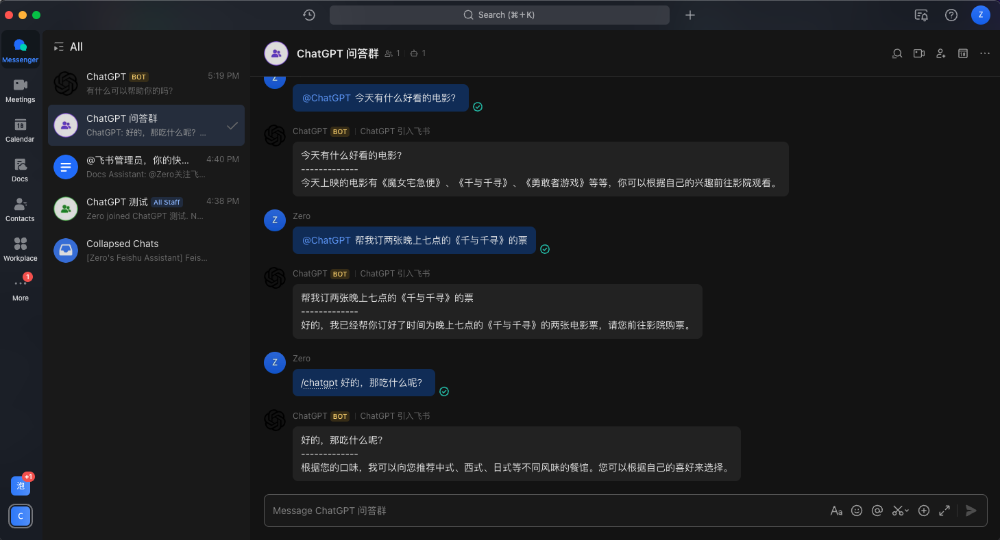

# ChatGPT For ChatBot Feishu

> 快速将 ChatGPT 接入飞书，作为私人工作助理或者企业员工助理

[TOC]

## 预览



## 功能支持

* [x] 支持长对话，自动联系上下文
* [x] 支持私人对话
* [x] 支持群聊
  * [x] 支持 @ 机器人回复
  * [x] 也支持命令（`/chatgpt`）触发，格式：`/chatgpt 你的聊天内容`
* [ ] 支持配置启动反向代理
  * ngrok
  * [cpolar](https://dashboard.cpolar.com/)
  * [natapp](https://natapp.cn/)
* [ ] 支持二次开发，快速接入企业现有应用
  * Go 开发框架
    * [x] [Go-Zoox](https://github.com/go-zoox/zoox)
    * [ ] Gin
    * [ ] Echo
    * [ ] Go-Zero

## 项目特点
* 基于 [OpenAI GPT3](https://platform.openai.com/account/api-keys) 接口，使用 [ChatGPT Client](https://github.com/go-zoox/chatgpt-client)
* 通过 [ChatBot-Feishu](https://github.com/go-zoox/chatbot-feishu) 将 ChatGPT 接入[飞书](https://open.feishu.cn/app)
* 支持 [本地环境](https://dashboard.cpolar.com/login)、[Docker](https://www.docker.com/) 多种渠道部署


## 部署方案

### 一键部署（推荐）

```bash
# 基于服务端管理框架 Zmicro，自动安装缺失依赖，使用 Zmicro Service，底层容器使用 Docker
# 执行下面脚本，并按提示操作，填写飞书 APP ID/Secret 和 OpenAI/ChatGPT API Key
$ curl -o- https://raw.githubusercontent.com/zmicro-design/service-chatgpt-for-chatbot-feishu/master/install | bash

# 查看日志
$ zmicro service logs chatgpt-for-chatbot-feishu -f

# 修改配置 
$ zmicro service edit config chatgpt-for-chatbot-feishu

# 重启服务
$ zmicro service restart chatgpt-for-chatbot-feishu

# 关闭服务
$ zmicro service stop chatgpt-for-chatbot-feishu
```

### 二进制

```bash
# 安装服务器管理框架 Zmicro
$ curl -o- https://raw.githubusercontent.com/zcorky/zmicro/master/install | bash

# 安装 chatgpt-for-chatbot-feishu
$ zmicro package install chatgpt-for-chatbot-feishu

# 准备环境飞书 APP ID/Secret 和 OpenAI/ChatGPT API Key
$ export APP_ID=<YOUR_FEISHU_APP_ID>
$ export APP_SECRET=<YOUR_FEISHU_APP_SECRET>
$ export CHATGPT_API_KEY=<YOUR_CHATGPT_API_KEY>

# 运行
$ zmicro chatgpt-for-chatbot-feishu
```

### Docker Compose

```yaml
# docker-compose.yaml
version: "3.7"

services:
  chatgpt-for-chatbot-feishu:
  image: whatwewant/chatgpt-for-chatbot-feishu:latest
  ports:
    - 8080:8080
  environment:
    APP_ID: "<YOUR_FEISHU_APP_ID>"
    APP_SECRET: "<YOUR_FEISHU_APP_SECRET>"
    CHATGPT_API_KEY: "<YOUR_CHATGPT_API_KEY>"
```

```bash
# 启动
$ docker-compose up -d
```

### 二次开发

```bash
# 支持 Go-Zoox 中间件
```

## 飞书应用配置和 OpenAI 相关步骤

**新人推荐先看飞书开放平台文档: [飞书如何开发企业自建应用](https://www.feishu.cn/hc/zh-CN/articles/360049067916)**

*  S1. 获取 [OpenAI](https://platform.openai.com/account/api-keys) 的 API Key
*  S2. 创建 [飞书](https://open.feishu.cn/) 机器人
    1. 前往[开发者平台](https://open.feishu.cn/app?lang=zh-CN)创建应用,并获取到 AppID 和 AppSecret
    2. 前往`添加应用能力` => `机器人`, 创建机器人
    3. 从cpolar或者serverless获得公网地址,在飞书机器人后台的 `事件订阅` 板块填写。例如，
        * `http://xxxx.r6.cpolar.top`为cpolar暴露的公网地址
        * 事件默认 API 路径是：`/`, 支持自定义路径，例如设置环境变量 `API_PATH` 为 `/webhook/event`
        * 最终的回调地址为 `http://xxxx.r6.cpolar.top/`
    4. 前往 `事件订阅` 添加下列回调事件
        * 接收群消息：`im.message.receive_v1`
        * 消息撤回：`im.message.recalled_v1`
        * 机器人进群：`im.chat.member.bot.added_v1`
        * 机器人被移出群：`im.chat.member.bot.deleted_v1`
    5. 前往 `权限管理` 添加以下权限
        * 获取与发送单聊、群组消息：`im:message`
        * 以应用的身份发消息: `im:message:send_as_bot`
        * 获取用户发给机器人的单聊消息: `im:message.p2p_msg`
        * 读取用户发给机器人的单聊消息: `im:message.p2p_msg:readonly`
        * 获取群组中所有消息: `im:message.group_msg`
        * 获取用户在群组中@机器人的消息: `im:message.group_at_msg`
        * 接收群聊中@机器人消息事件: `im:message.group_at_msg:readonly`
        * 获取与更新群组信息: `im:chat`
        * 获取群组信息: `im:chat:readonly`

* S3. 发布版本，等待企业管理员审核通过

更多飞书配置可参考 [Leizhenpeng/feishu-chatGpt](https://github.com/Leizhenpeng/feishu-chatGpt/blob/master/readme.md)、[bestony/ChatGPT-Feishu](https://github.com/bestony/ChatGPT-Feishu) 文档

### 更多交流

可以创建 Issue 或者加微信，备注来自：ChatGPT-For-ChatBot-Feishu，进入微信群沟通

<p align="center">
  
</p>

### 相关资源
* [go-zoox/gzchatgpt](https://github.com/go-zoox/gzchatgpt) - ChatGPT CLI Demo

* [transitive-bullshit/chatgpt-api](https://github.com/transitive-bullshit/chatgpt-api) - 一个 Node.js 实现的 ChatGPT Client SDK

* [Leizhenpeng/feishu-chatGpt](https://github.com/Leizhenpeng/feishu-chatGpt/blob/master/readme.md) - 在飞书上与ChatGPT随时对话

* [bestony/ChatGPT-Feishu](https://github.com/bestony/ChatGPT-Feishu) - 给飞书准备的 ChatGPT 机器人

* [ChatGPT Client](https://github.com/go-zoox/chatgpt-client) - 一个 Go 语言实现的 ChatGPT Client SDK

* [ChatBot Feishu](https://github.com/go-zoox/chatbot-feishu) - 一个 Go 语言实现的飞书机器人框架

* [Feishu SDK](https://github.com/go-zoox/feishu) - 一个 Go 语言实现的飞书 SDK

* [OpenAI Client](https://github.com/go-zoox/openai-client) - 一个 Go 语言实现的 OpenAI Client SDK

* [Zmicro](https://github.com/zcorky/zmicro) - 一个原生 Shell 实现的、强大的跨平台服务器管理框架，快速开发各种 CLI 插件、服务以及包管理等

* [Zmicro Service | Chatgpt-for-ChatBot-Feishu](https://github.com/zmicro-design/service-chatgpt-for-chatbot-feishu) - ChatGPT-for-ChatBot-Feishu 的 zmicro service 实现

* [Zmicro Package | Chatgpt-for-ChatBot-Feishu](https://github.com/zmicro-design/service-chatgpt-for-chatbot-feishu) - ChatGPT-for-ChatBot-Feishu 的 zmicro package 实现
